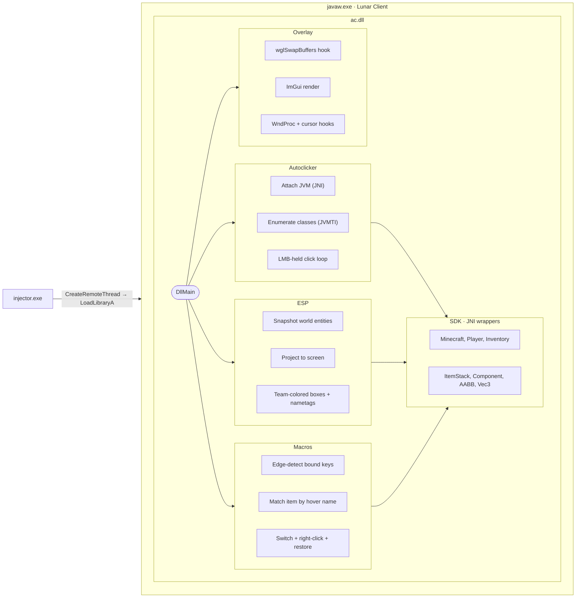

# manuclicker

A native DLL + ImGui overlay for Lunar Client, built as a **hands-on exploration of how JNI and JVMTI interact with a running JVM**. Targets Lunar Client 1.21.11 (Fabric intermediary mappings).

The point of this project is the seam between native code and the JVM. The modules here exist to exercise specific aspects of that boundary: enumerating loaded classes via JVMTI, resolving obfuscated names through Fabric intermediary mappings, calling into `Minecraft`/`Player`/`Inventory`/`ItemStack` from a non-MC thread, walking entity snapshots, projecting world → screen without touching MC's renderer, and surviving the cursor/window-message contortions GLFW expects.

---

## Architecture

Two binaries: an injector and the payload DLL. The injector locates `javaw.exe`, allocates remote memory, writes the DLL path, and calls `LoadLibraryA` via a remote thread. Once loaded inside the JVM, the DLL stands up its own threads alongside MC's render loop.



### Threads

| Thread       | Started by      | Role                                                        |
|--------------|-----------------|-------------------------------------------------------------|
| Render       | MC (hooked)     | ImGui draw + input swallow when overlay visible             |
| Autoclicker  | `DllMain`       | Enumerates classes, attaches JVM, runs click loop           |
| ESP          | `DllMain`       | Reads entity snapshot each frame, publishes for overlay     |
| Macros       | `DllMain`       | Polls bound keys, fires hotbar switch + right-click         |

Each JVM-touching thread calls `AttachCurrentThread` independently. `lc->env` is `thread_local` so the per-thread JNIEnv routes correctly without cross-thread sharing.

### Shared state

`g_settings` is a header-defined singleton (`inline Settings g_settings`). Written by the overlay, read by the modules. Persisted to `%APPDATA%\manuclicker\config.cfg`; loaded on attach, saved on every settings dirty + on detach.

### Overlay input model

While the menu is open, all keyboard/mouse messages are swallowed in the WndProc hook so MC's GLFW pump never sees them. `SetCursorPos`, `ClipCursor`, `ShowCursor`, and `SetCursor` are hooked to no-op so GLFW's cursor-disabled mode can't fight the visible cursor. Held inputs are released on open via synthesized `WM_KEYUP` so the player doesn't keep walking forward.

---

## Mapping system

Lunar uses Fabric intermediary names. Mappings live in JSON per game version; CMake reads them at configure time and configures `Mappings.h` from a template.

```mermaid
flowchart LR
    JSON["mappings/fabric_1.21.11.json"]
    TPL["dll/SDK/Mappings.h.in"]
    OUT["build/dll/Mappings.h"]
    JSON -->|"-DMAPPING_VERSION"| TPL
    TPL  -->|"configure_file()"|  OUT
```

To add a new MC version, copy `mappings/fabric_1.21.11.json`, update the intermediary names, and build with `-DMAPPING_VERSION=<name>`.

---

## Features

- **Autoclicker** — randomized Gaussian-jittered LMB while held; respects block-breaking hold behavior; toggleable via keybind. Demonstrates synthesizing input events through the JNI layer.
- **ESP** — team-colored boxes + nametag chunks + distance, projected from a JNI entity snapshot with partial-tick interpolation. Demonstrates reading live world state from a native thread.
- **Macros** — dynamic list of up to 10 hotbar macros. Each matches an item by display-name substring (case-insensitive, includes anvil renames), switches to that slot, right-clicks once, and restores the previously held slot. Demonstrates calling into `Inventory` and `ItemStack` via JNI from outside the game thread.
- **Persistent config** — all settings + keybinds + macros saved to `%APPDATA%\manuclicker\config.cfg` with schema versioning.
- **Self-destruct** — UNLOAD button or `END` key triggers clean DLL unload via `FreeLibraryAndExitThread`. Demonstrates orderly JNI teardown.

---

## Building

Requirements: Windows, Visual Studio 2022+, CMake 3.30+, JDK 21 (`JAVA_HOME` set). ImGui and MinHook are fetched at configure time.

```bat
cmake -S . -B build -DMAPPING_VERSION=fabric_1.21.11
cmake --build build --config Release
```

Outputs:
- `build/dll/Release/DLL.dll`
- `build/injector/Release/INJECTOR.exe`

CI builds every push to `main` and uploads an artifact. Tag `v*` to publish a release.

---

## Usage

1. Download `ac.dll` + `injector.exe` from the latest Actions run or release.
2. Launch Lunar Client, join a world or server.
3. Run `injector.exe`.
4. `INSERT` opens the overlay. `END` unloads.

---

## What each module demonstrates

| Module        | JNI/JVMTI concept explored                                                                      |
|---------------|-------------------------------------------------------------------------------------------------|
| Autoclicker   | Input synthesis via JNI; calling Java methods from a native thread; timing across the boundary  |
| ESP           | Reading entity state via JVMTI class enumeration; world→screen projection from native code      |
| Macros        | Calling into `Inventory`/`ItemStack`; resolving obfuscated Fabric intermediary names at runtime |
| Overlay       | Hooking `wglSwapBuffers` to drive ImGui; WndProc/cursor interop with GLFW                       |
| Self-destruct | Clean `DetachCurrentThread` + `FreeLibraryAndExitThread` teardown sequence                      |

---

## Notes

This project targets a local Lunar Client instance for learning purposes. Do not use on public servers.
