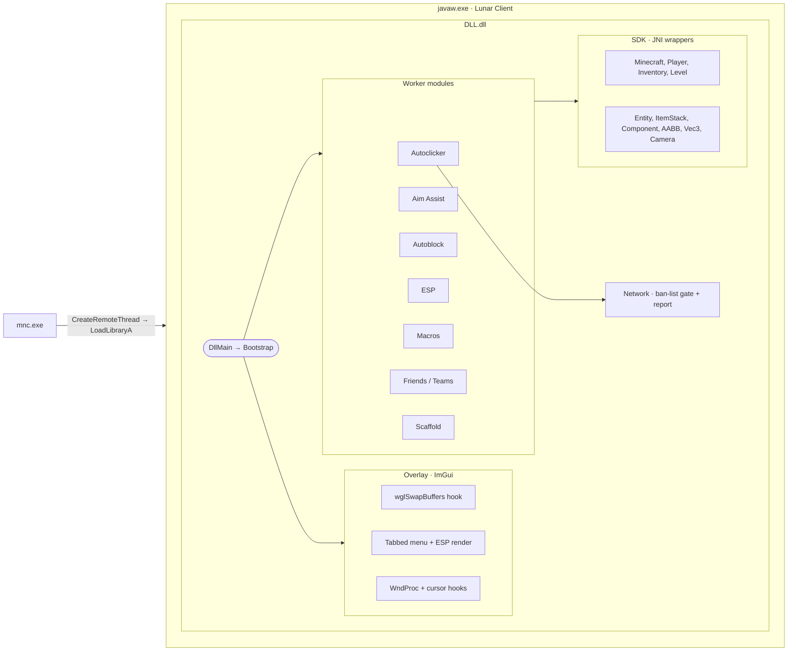
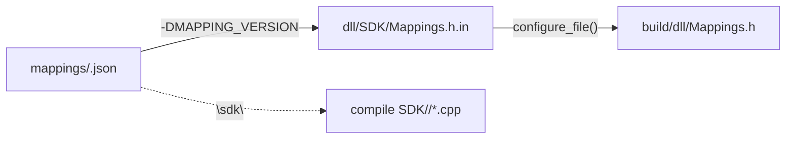

# JNI Minecraft Client

A native DLL + ImGui overlay for Lunar Client, built as a **hands-on exploration of how JNI and JVMTI interact with a running JVM** — and as a controlled testbed for anti-cheat research. Supports multiple Minecraft versions from one codebase: Lunar Client 1.21.11 (Fabric intermediary mappings) and 1.8.9 (MCP names). The injector auto-detects the running version and pulls the matching DLL.

The point of this project is the seam between native code and the JVM. The modules here exist to exercise specific aspects of that boundary: enumerating loaded classes via JVMTI, resolving obfuscated names through Fabric intermediary mappings, calling into `Minecraft`/`Player`/`Inventory`/`ItemStack` from a non-MC thread, walking entity snapshots, projecting world → screen without touching MC's renderer, and surviving the cursor/window-message contortions GLFW expects.

---

## Architecture

Two binaries: an injector and the payload DLL. The injector finds the game window, reads its title to detect the Minecraft version, downloads the matching DLL from the release (see [Version manifest](#version-manifest)), then locates `javaw.exe`, allocates remote memory, writes the DLL path, and calls `LoadLibraryA` via a remote thread. Once loaded inside the JVM, `DllMain` spawns a bootstrap thread that loads settings, installs the overlay hooks, and starts one worker thread per module alongside MC's render loop.



### Threads

| Thread       | Started by   | Role                                                        |
|--------------|--------------|-------------------------------------------------------------|
| Render       | MC (hooked)  | ImGui draw + input swallow when overlay visible             |
| Autoclicker  | `Bootstrap`  | Enumerates classes, attaches JVM, runs click loop, ban gate |
| Aim Assist   | `Bootstrap`  | Steers the camera toward the nearest in-FOV entity          |
| Autoblock    | `Bootstrap`  | Right-click-blocks while attacking with a sword             |
| ESP          | `Bootstrap`  | Reads entity snapshot each frame, publishes for overlay     |
| Macros       | `Bootstrap`  | Polls bound keys, fires hotbar switch + right-click         |
| Friends      | `Bootstrap`  | Resolves player teams/colors for highlighting               |

Scaffold doesn't get its own thread — it ticks on the render thread (inside MC's loop) so its world reads never race a block placement.

Each JVM-touching thread calls `AttachCurrentThread` independently. `lc->env` is `thread_local` so the per-thread JNIEnv routes correctly without cross-thread sharing.

### Shared state

`g_settings` is a header-defined singleton (`inline Settings g_settings`). Written by the overlay, read by the modules; loaded on attach, saved on every settings change + on detach. The friend list is guarded by its own mutex since the overlay and Friends thread both touch it.

### Overlay input model

While the menu is open, all keyboard/mouse messages are swallowed in the WndProc hook so MC's GLFW pump never sees them. `SetCursorPos`, `ClipCursor`, `ShowCursor`, and `SetCursor` are hooked to no-op so GLFW's cursor-disabled mode can't fight the visible (software-drawn) cursor. Held inputs are released on open via synthesized `WM_KEYUP` so the player doesn't keep walking forward.

### Source layout

```
dll/
  config/     Settings (runtime) + Config.h.in (build-time secrets template)
  logger/     File logger
  teardown/   Worker registry + clean self-unload
  modules/    autoclicker, aim, autoblock, esp, macros, friends, scaffold
  network/    Ban-list check + Discord report (WinHTTP)
  overlay/    ImGui overlay, widgets, theme, per-tab UI
  SDK/        JNI/JVMTI wrappers + generated Mappings.h
    1.8.9/      Version-specific method bodies (MCP)
    1.21.11/    Version-specific method bodies (Fabric)
injector/     Remote-thread injector
mappings/     Per-version name maps (fabric_1.21.11.json, lunar_1.8.9.json)
versions.txt  Window-title → DLL manifest (injector reads at runtime)
data/         Embedded assets (logo.png)
```

The shared `SDK/*.cpp` hold the boilerplate and version-agnostic methods; only the bodies that differ between game versions live in `SDK/<version>/`. The build compiles exactly one version subfolder, selected by the mapping's `"sdk"` field — so no `#ifdef` soup in the SDK logic.

---

## Mapping system

Each game version has a JSON name map (Fabric intermediary names for 1.21.11, MCP names for the MCP-deobfuscated 1.8.9 jar Lunar ships). CMake reads the chosen map at configure time and configures `Mappings.h` from a template. Two extra JSON fields drive the build:

- `"generation"` (`modern`/`legacy`) → compile def `MNC_LEGACY=0/1`.
- `"sdk"` (e.g. `1.21.11`/`1.8.9`) → which `SDK/<sdk>/` subfolder is compiled.



To add a new MC version: copy a mapping JSON, fill in the names, set `"generation"`/`"sdk"`, and build with `-DMAPPING_VERSION=<name>`. If the version's reflection layout matches an existing SDK folder, point `"sdk"` at it; otherwise fork a new `SDK/<sdk>/`.

### Version manifest

The injector is **version-agnostic** — it doesn't hardcode DLL names. At runtime it downloads `versions.txt` from the release and matches the game's window title against it:

```
1.8=mnc_1.8.9.dll
1.21=mnc_1.21.11.dll
1.26=mnc_1.26.x+.dll
*=mnc_1.26.x+.dll
```

First matching prefix wins; `*` is the fallback. Adding a new version therefore needs **no injector rebuild** — just publish the new DLL and add a line to `versions.txt`. If the manifest can't be resolved, the injector tells the user to update rather than guessing.

---

## Features

- **Autoclicker** — randomized Gaussian-jittered LMB while held; respects block-breaking hold behavior; toggleable via keybind. Demonstrates synthesizing input events through the JNI layer.
- **Aim Assist** — smoothly steers the camera toward the nearest entity inside a configurable FOV cone and range, with separate horizontal/vertical speeds and an optional "only while attacking" mode. Demonstrates reading live entity positions + camera state from a native thread.
- **Autoblock** — automatically right-click-blocks while attacking, optionally only when a sword is held, with configurable delay and cooldown. Demonstrates inspecting the held `ItemStack` via JNI.
- **ESP** — team-colored boxes + nametag chunks + distance + health, projected from a JNI entity snapshot with partial-tick interpolation. Demonstrates reading live world state from a native thread and projecting world → screen without the MC renderer.
- **Friends / Teams** — maintain a friend list and detect scoreboard teams by color; friends and teammates are highlighted and excluded from targeting. Demonstrates walking `PlayerTeam` / `Style` / `TextColor` through JNI.
- **Macros** — dynamic list of up to 10 hotbar macros. Each matches an item by display-name substring (case-insensitive, includes anvil renames), switches to that slot, right-clicks once, and restores the previously held slot. Demonstrates calling into `Inventory` and `ItemStack` via JNI from outside the game thread.
- **Scaffold** — auto-places blocks beneath the player while bridging, deriving movement from player velocity (so it's layout- and rebind-agnostic) and ticking on the render thread to stay in sync with world state. Demonstrates driving placement input from live physics state read through JNI.
- **Safety gate** — the local player's UUID is checked against a remote banned list (GitHub-hosted) over WinHTTP; a match triggers self-destruct, and first-seen accounts are reported to a Discord webhook (username, UUID, and game version). Endpoints are baked in at build time from environment variables and are blank by default.
- **Persistent config** — all settings + keybinds + macros + friends saved to `%APPDATA%` with schema versioning (v3).
- **Self-destruct** — the in-menu toggle or the self-destruct key (default `END`) triggers a clean DLL unload via `FreeLibraryAndExitThread`. Demonstrates orderly JNI teardown.

---

## Building

Requirements: Windows, Visual Studio 2022+, CMake 3.30+, JDK 21 (`JAVA_HOME` set). ImGui, MinHook, and stb are fetched at configure time; `data/logo.png` is embedded into the DLL.

```bat
cmake -S . -B build -DMAPPING_VERSION=fabric_1.21.11
cmake --build build --config Release
```

Pick the target version with `-DMAPPING_VERSION` (`fabric_1.21.11` or `lunar_1.8.9`); each produces a DLL for that version. Optionally set `MNC_WEBHOOK_PATH` and `MNC_BANNED_PATH` before configuring to bake in the report webhook and banned-list endpoints; both default to empty (the safety gate is then a no-op).

Outputs:
- `build/dll/Release/DLL.dll`
- `build/INJECTOR/Release/mnc.exe`

CI builds every version on each push and publishes rolling prereleases — `release` from `main`, `dev` from `development` — each containing the DLLs, `mnc.exe`, and `versions.txt`. The `latest` tag is frozen with the legacy `ac_*`/`injector.exe` artifacts so older injectors keep working. Tag `v*` to cut a versioned release.

---

## Usage

1. Download `mnc.exe` from the [latest release](https://github.com/expires/autoclicker/releases/tag/release). You don't need the DLL — the injector fetches the right one for your version.
2. Launch Lunar Client (1.21.11 or 1.8.9), join a world or server.
3. Run `mnc.exe`. It detects the version, downloads the matching DLL, and injects.
4. **Right Shift** opens the overlay (rebindable in Settings); the self-destruct key (default **END**) unloads.

---

## Notes

This project targets a local Lunar Client instance for learning purposes. Do not use on public servers.
