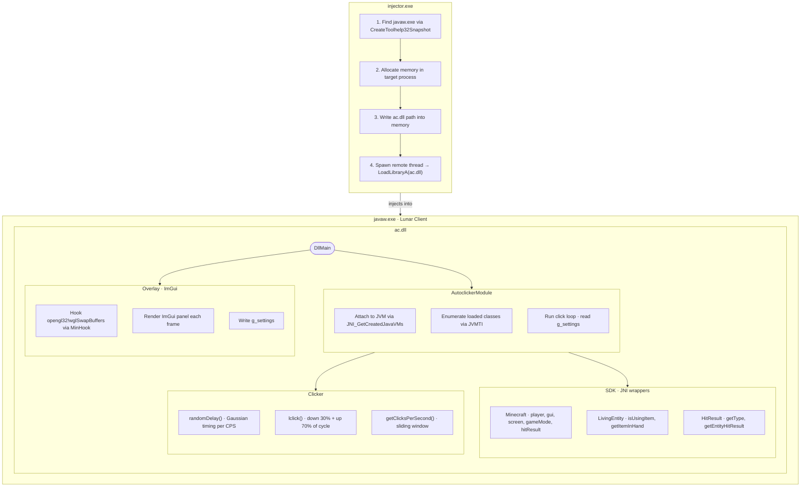
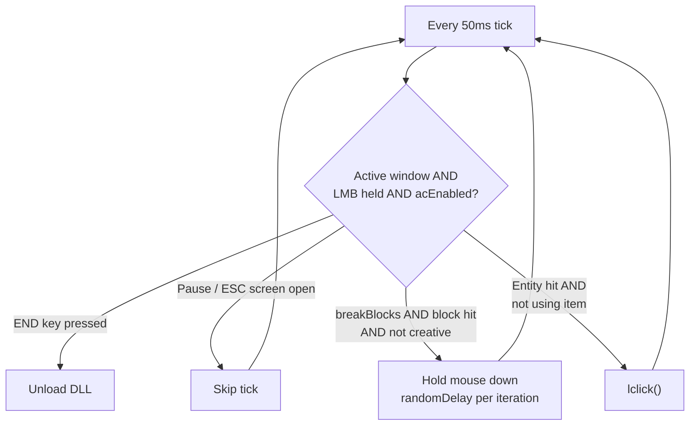
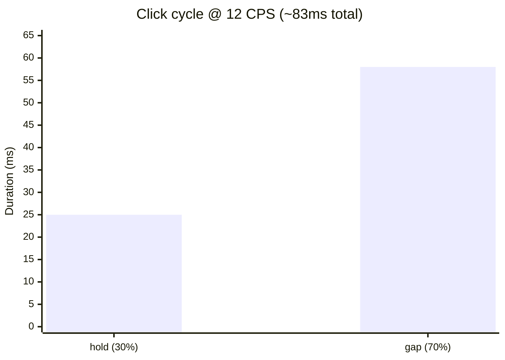
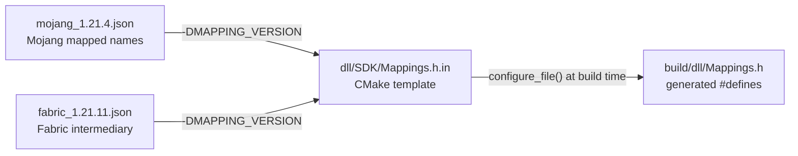

# Lunar Autoclicker

A DLL-based autoclicker for Lunar Client, designed for private server anticheat testing. Supports Lunar Client 1.21.4 (Mojang mappings) and 1.21.11 (Fabric intermediary mappings).

---

## Table of Contents

- [Architecture](#architecture)
- [Mapping System](#mapping-system)
- [Building](#building)
- [Usage](#usage)
- [Overlay](#overlay)

---

## Architecture

The project is split into two binaries: an injector executable and the payload DLL.



### Shared state

`g_settings` is a plain struct read/written by both the overlay (render thread) and the autoclicker (game thread):

| Field         | Default | Description                          |
|---------------|---------|--------------------------------------|
| `acEnabled`   | true    | Master on/off for clicking           |
| `breakBlocks` | true    | Enable block-breaking hold behaviour |
| `cps`         | 10      | Target clicks per second (1–50)      |

### Click loop logic



### Timing model

Each click cycle targets `1000 / CPS` ms total, split into:



Both segments are sampled from a Gaussian distribution (stddev = 20% of mean) with a 1% chance of an extended pause to simulate natural human variance.

---

## Mapping System

Lunar Client obfuscates Minecraft class names. The mapping version is selected at compile time via `-DMAPPING_VERSION` and injected into `Mappings.h` from a JSON file.



To add a new version, create `mappings/<version>.json` matching the schema of an existing file, then build with `-DMAPPING_VERSION=<version>`.

---

## Building

### Requirements

- Windows, Visual Studio 2022+
- CMake 3.30+
- Java JDK 21 (`JAVA_HOME` must be set)
- Internet access at configure time (ImGui and MinHook are fetched via FetchContent)

### Local build

```bat
cmake -S . -B build -DMAPPING_VERSION=fabric_1.21.11
cmake --build build --config Release
```

Outputs:
- `build/DLL/Release/DLL.dll`
- `build/INJECTOR/Release/INJECTOR.exe`

### GitHub Actions

Every push to `main` triggers a matrix build for all mapping versions. Artifacts are uploaded per version (`autoclicker-mojang_1.21.4`, `autoclicker-fabric_1.21.11`). Tag a commit `v*` to create a GitHub Release with all files attached.

---

## Usage

1. Download the artifact for your Lunar Client version from the Actions tab or Releases.
2. Place `ac_<version>.dll` (rename to `ac.dll`) and `injector.exe` in the same folder.
3. Launch Lunar Client and join a world or server.
4. Run `injector.exe`. It will locate `javaw.exe` and inject the DLL automatically.
5. Hold left click in-game to activate. Press `END` to unload.

---

## Overlay

An in-game ImGui panel is rendered directly into the game's OpenGL context via a `wglSwapBuffers` hook.

**Toggle:** `INSERT`

```
┌─ AutoClicker ──────────────────┐
│ [x] Enabled                    │
│ [x] Break Blocks               │
│ ─────────────────────────────  │
│ CPS [────●─────────────] 10    │
└────────────────────────────────┘
```

Changes made in the overlay take effect immediately — no re-injection required.

---

## Notes

- Intended for use on private servers for anticheat development and testing only.
- Public servers with anticheat will likely detect or flag this.
- Intended for research with JNI
